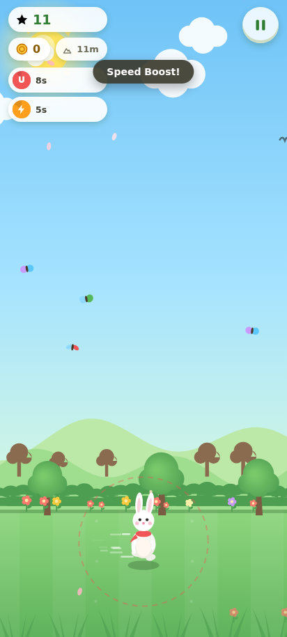

# Run in the Garden

A complete, mobile-first 2D endless runner set in a bright cartoon garden.
**100% offline** - all assets, code, music and sound effects are bundled locally.
No accounts, no servers, no data collection. Includes **AdMob in TEST MODE**.



## Features

- **Endless runner gameplay** - 3 lanes, swipe/arrows to move, jump over rocks,
  pots, branches and bushes, dodge puddles and tall rose trellises
- **Speed ramps up** the longer you survive; score = distance + coins (coin 10, star 50)
- **4 power-ups**: Shield (blocks one crash), Magnet (pulls coins), Speed Boost
  (dash + smash obstacles for bonus points), Double Coins (2x for 10s)
- **Living garden**: parallax hills, hedges, trees, benches, fountain, lamps,
  flowers, butterflies, birds, falling petals - all animated, all procedural
- **Full game loop**: main menu, How to Play, HUD, pause/resume with countdown,
  crash -> optional rewarded revive, game over with stats, Play Again
- **Local persistence**: best score, best distance, coin bank, games played,
  audio settings (localStorage)
- **Local audio engine**: cheerful Web Audio music loop + synthesized SFX with
  separate music/SFX toggles - no audio files, no network
- **Installable PWA**: web app manifest + service worker precaches every asset;
  works in airplane mode
- **AdMob TEST MODE**: banner on menus, interstitial every 3rd game over
  (frequency capped), rewarded videos (revive + double coins), app-open on
  native cold start - all using Google's official test ad units

## Controls

| Action       | Touch                  | Keyboard        |
|--------------|------------------------|-----------------|
| Change lane  | Swipe left/right, or on-screen buttons | Arrow Left/Right or A/D |
| Jump         | Swipe up / tap, or Jump button | Space / Arrow Up / W |
| Pause        | Pause button           | P / Escape      |

## Run locally

The game is plain HTML/JS (no build step needed):

```bash
# Option A - just open the file
open www/index.html          # macOS
# Option B - serve it (recommended, enables PWA install)
cd www && python3 -m http.server 8080
# then visit http://localhost:8080
```

## AdMob Test Mode

All ad IDs in `js/config.js` and `capacitor.config.ts` are **Google's official
test IDs** - they always serve test ads and never count real impressions:

| Format        | Test ad unit ID                          | Where it appears |
|---------------|------------------------------------------|------------------|
| App ID        | `ca-app-pub-3940256099942544~3347511713` | AndroidManifest / Capacitor config |
| Banner        | `ca-app-pub-3940256099942544/6300978111` | Menu / How-to / Game Over (bottom) |
| Interstitial  | `ca-app-pub-3940256099942544/1033173712` | Every 3rd game over (45s min gap) |
| Rewarded      | `ca-app-pub-3940256099942544/5224354917` | Revive after crash / Double coins |
| App Open      | `ca-app-pub-3940256099942544/3419835294` | Native cold start (optional) |

**Two running modes, handled automatically** (`js/admob.js`):

1. **Native (APK/AAB)** - detects Capacitor and drives the real AdMob SDK
   through `@capacitor-community/admob` (initialized with
   `initializeForTesting: true`).
2. **Web / PWA preview** - no native SDK available, so the game shows a
   clearly-labelled "Google AdMob - TEST" simulated ad for banners,
   interstitials and rewarded videos. This lets you exercise the entire ad
   flow in a browser with zero risk.

Ad frequency, test IDs and the app-open toggle live in `js/config.js`
(`RG.Config.ads`).

**Going to production:** replace the test IDs with your own from the AdMob
console, set `initializeForTesting: false`, and add Google's UMP consent flow
(see `BUILD-APK.md`).

## Project structure

```
run-in-the-garden/
+-- www/                    <-- the game (also the Capacitor webDir)
|   +-- index.html          <-- entry + all UI screens
|   +-- css/style.css       <-- mobile-game UI styling
|   +-- js/                 <-- config, utils, storage, audio, input,
|       |                       world, player, entities, particles,
|       |                       admob, ui, game
|   +-- manifest.json       <-- PWA manifest
|   +-- sw.js               <-- service worker (offline cache)
|   +-- icons/              <-- app icons (PWA)
|   +-- legal/              <-- privacy policy + terms (openable in-game)
+-- capacitor.config.ts     <-- Android shell config (test app ID)
+-- package.json            <-- Capacitor deps + build scripts
+-- BUILD-APK.md            <-- step-by-step APK / AAB build guide
+-- legal/                  <-- standalone copies of the legal pages
+-- screenshots/            <-- store screenshots
+-- icon-1024.png           <-- hi-res icon for stores
+-- feature-graphic.png     <-- 1024x500 Play Store feature graphic
```

## Performance notes

- Everything is drawn procedurally on a single canvas - zero image downloads,
  crisp on any DPI, tiny footprint (< 200 KB total)
- Device pixel ratio capped at 2; particles capped at 240
- Fixed-logical-width scaling keeps gameplay identical on every screen
- No frameworks, no build step, no network calls

## License

All code and assets are provided for you to publish. Replace placeholder
contact details in the legal pages before release.
